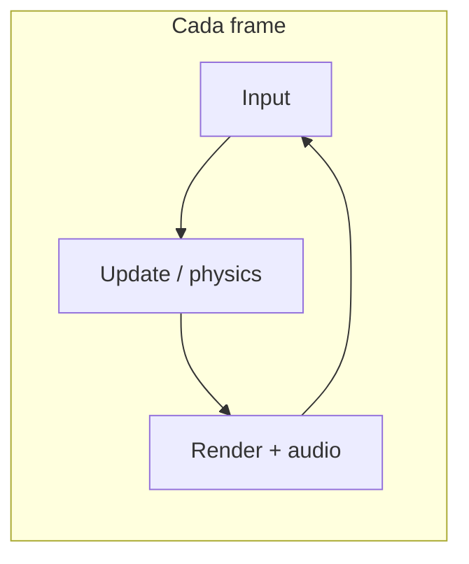
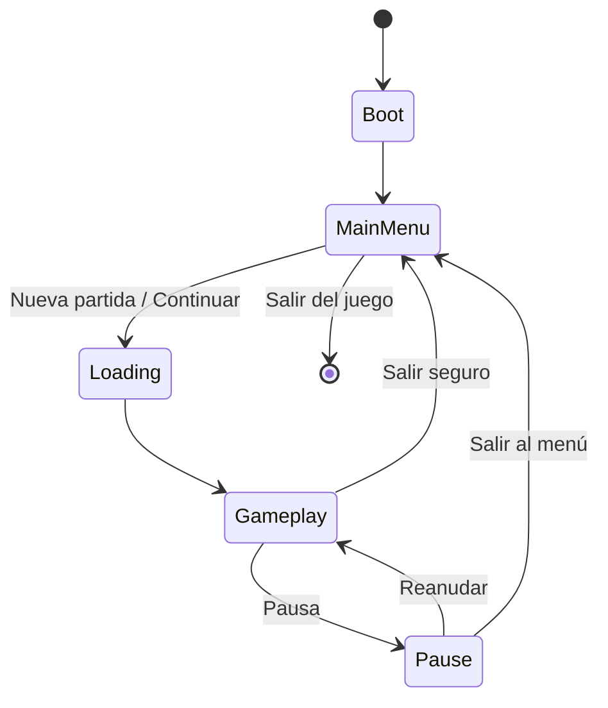

# Diagramas — loop y estados

## Game loop (alto nivel)

## Estados del juego (propuesta)

Godot suele implementarse con **cambio de escena** (`change_scene_to_packed`) o un **árbol** bajo un `GameRoot` que muestra/oculta capas. Documentad la opción elegida en `architecture.md` cuando la implementéis.
